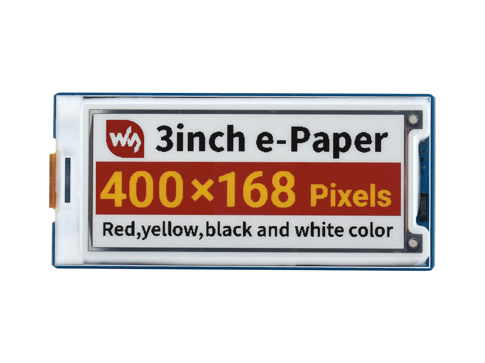

# ESP-IDF ESP32-S3 Waveshare 3 inch e-Paper

`Display` [e-Paper EPS-3in0G](https://www.waveshare.net/shop/3inch-e-Paper-Module-G.htm)   
- 4 colors (red, yellow, black, black)
- 3-wire / 4-wire SPI
- 400 x 168 pixels
- refresh rate 12s

`Chip` ESP32-S3

`Platform` esp-idf 5.3.0

